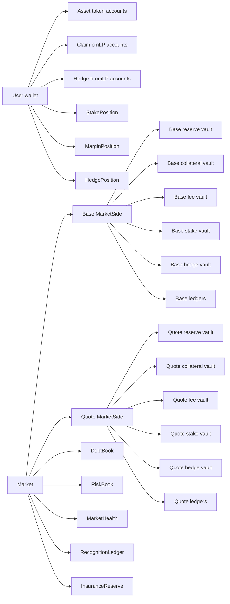
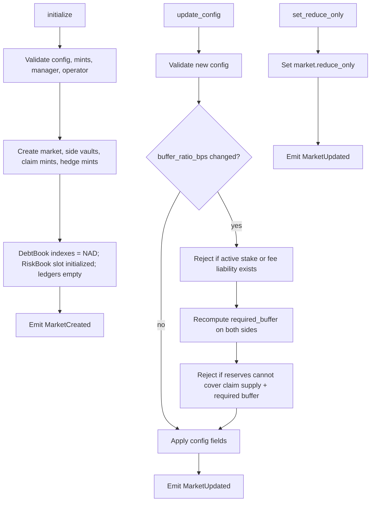
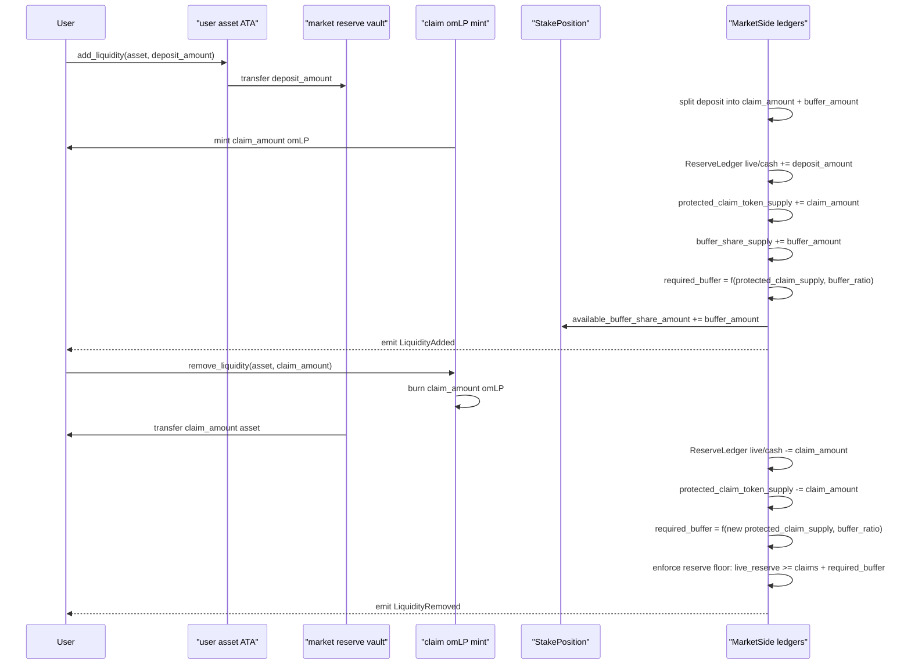
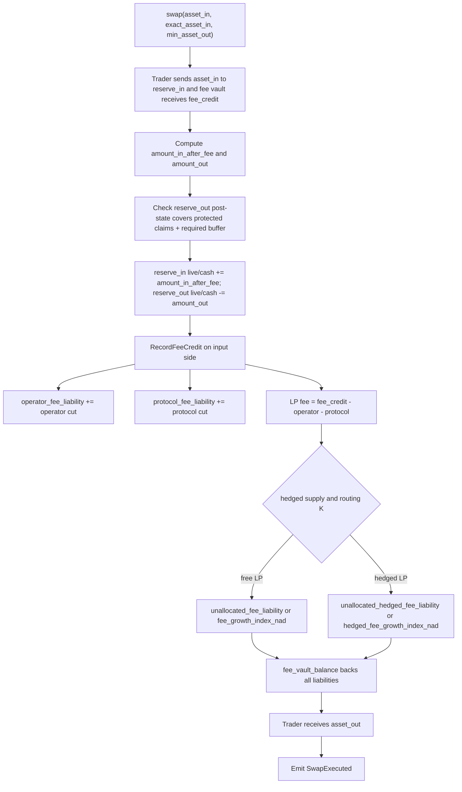
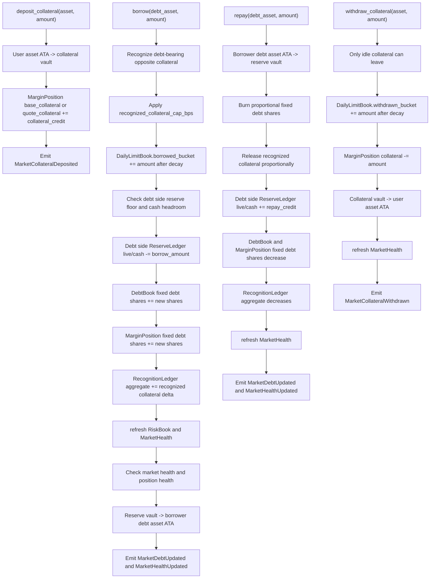
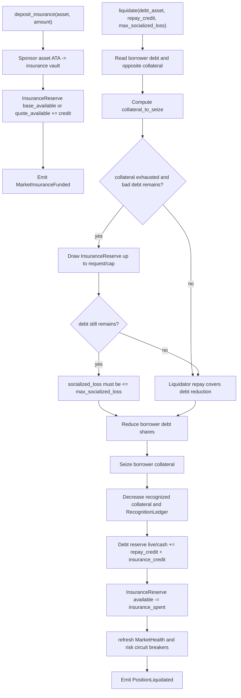
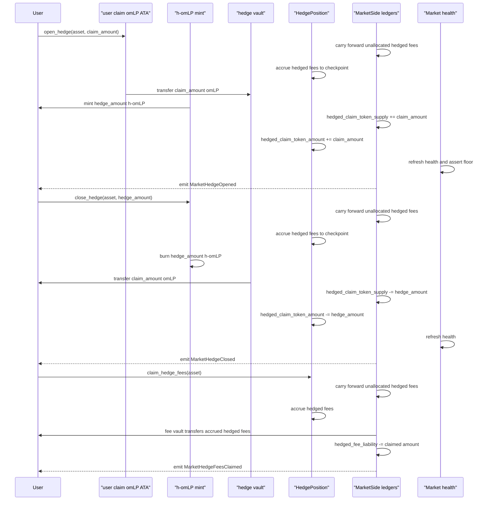
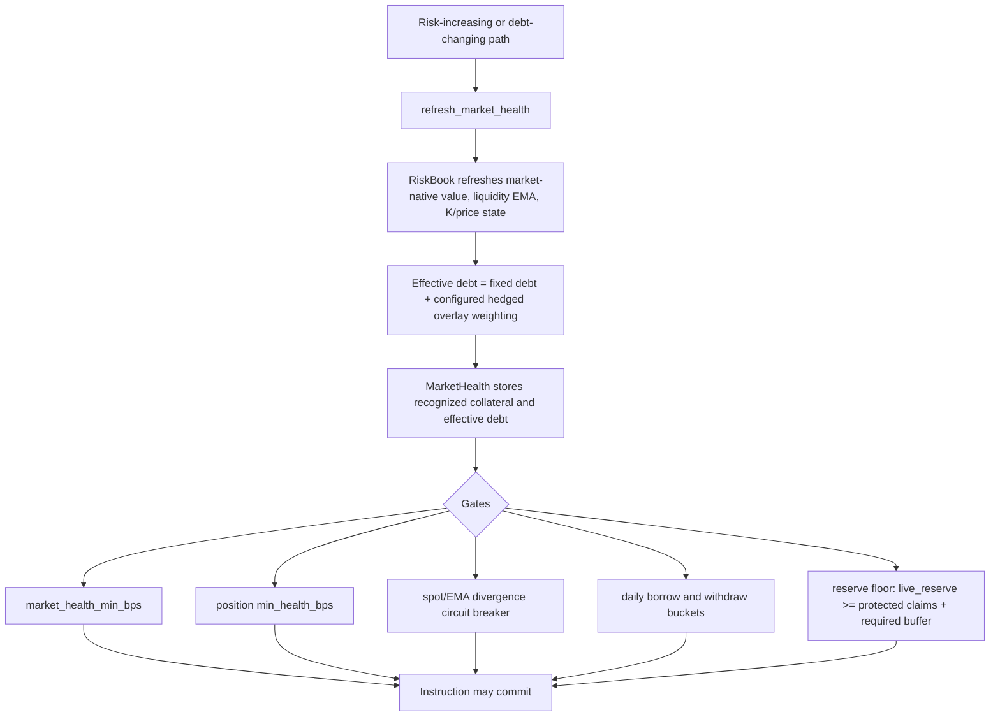
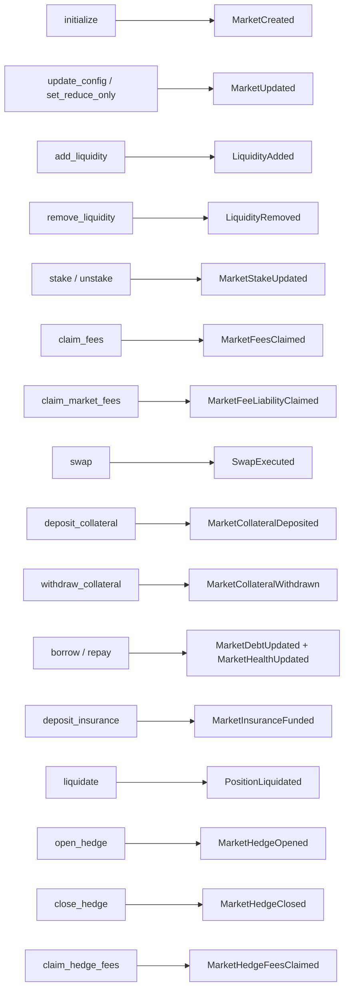

# Omnipair V2 User Flow Charts

These charts summarize the current V2 implementation in `programs/omnipair-v2/src`.

## Legend

- `Market` owns two `MarketSide`s: base and quote.
- `ReserveLedger`: live reserve, cash reserve, reserved liability.
- `ClaimTokenLedger`: protected claim supply, hedged claim supply, staked claim supply.
- `BufferLedger`: buffer share supply, staked buffer shares, required buffer, buffer ratio.
- `FeeLedger`: fee vault balance plus staker, hedged, unallocated, operator, and protocol liabilities.
- `DebtBook`: market-wide fixed debt shares and borrow indexes.
- `RiskBook` and `MarketHealth`: market valuation, liquidity EMA, circuit breaker, and debt health stats.
- `RecognitionLedger`: debt-bearing recognized collateral aggregates.
- User positions are `StakePosition`, `MarginPosition`, and `HedgePosition`.

## 1. Whole System Map



## 2. Market Admin Flow



## 3. LP Principal Flow



Key hindsight: base omLP is fixed principal. Deposits mint only the protected claim amount; buffer shares are junior accounting credited to `StakePosition`, not transferable principal.

## 4. Fee Eligibility And Fee Claims

```mermaid
sequenceDiagram
  participant User
  participant ClaimATA as "user claim omLP ATA"
  participant StakeVault as "stake vault"
  participant StakePos as "StakePosition"
  participant FeeVault as "fee vault"
  participant Side as "MarketSide FeeLedger"

  User->>ClaimATA: stake(claim_amount, buffer_share_amount)
  Side->>Side: carry forward unallocated staker fees if active units exist
  StakePos->>StakePos: accrue fees to checkpoint
  ClaimATA->>StakeVault: transfer claim_amount
  StakePos->>StakePos: available_buffer -= buffer_share_amount
  StakePos->>StakePos: staked_claim += claim_amount; staked_buffer += buffer_share_amount
  Side->>Side: staked_claim_token_supply += claim_amount
  Side->>Side: staked_buffer_share_amount += buffer_share_amount
  Side-->>User: emit MarketStakeUpdated

  User->>StakePos: unstake(claim_amount, buffer_share_amount)
  Side->>Side: carry forward unallocated staker fees
  StakePos->>StakePos: accrue fees to checkpoint
  StakeVault->>ClaimATA: transfer claim_amount
  StakePos->>StakePos: staked_claim -= claim_amount; staked_buffer -= buffer_share_amount
  StakePos->>StakePos: available_buffer += buffer_share_amount
  Side->>Side: staked supply counters decrease
  Side-->>User: emit MarketStakeUpdated

  User->>StakePos: claim_fees(asset)
  Side->>Side: carry forward unallocated staker fees
  StakePos->>StakePos: accrue fees to checkpoint
  FeeVault->>User: transfer accrued_fee_amount
  Side->>Side: fee_liability -= claimed amount
  StakePos->>StakePos: accrued_fee_amount = 0
  Side-->>User: emit MarketFeesClaimed

  User->>Side: claim_market_fees(operator or protocol)
  FeeVault->>User: transfer selected market fee bucket
  Side->>Side: operator_fee_liability or protocol_fee_liability = 0
  Side-->>User: emit MarketFeeLiabilityClaimed
```

Key hindsight: fees do not rebase omLP. Swap fees create liabilities in `FeeLedger`; staked matched claim plus buffer receives fee index growth.

## 5. Swap Flow And Fee Routing



## 6. Borrowing, Repay, And Collateral Flow



Key hindsight: idle collateral does not support market health. Borrow converts capped opposite-side collateral into recognized debt-bearing collateral.

## 7. Liquidation And Insurance Flow



## 8. Hedged LP Wrapper Flow



Key hindsight: h-omLP is an overlay wrapper around base omLP. It unwraps back into claim omLP and has separate hedged fee accounting.

## 9. Health, Limits, And Circuit Breakers



## 10. One-Line Flow Index



